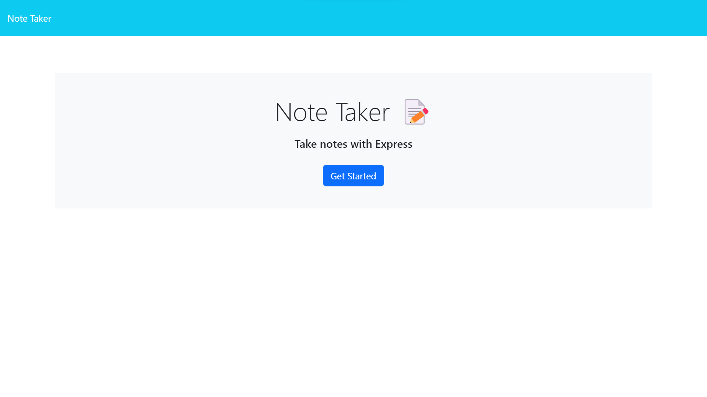
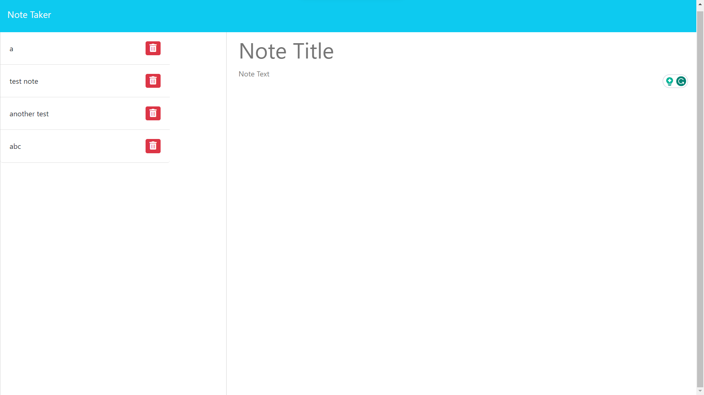
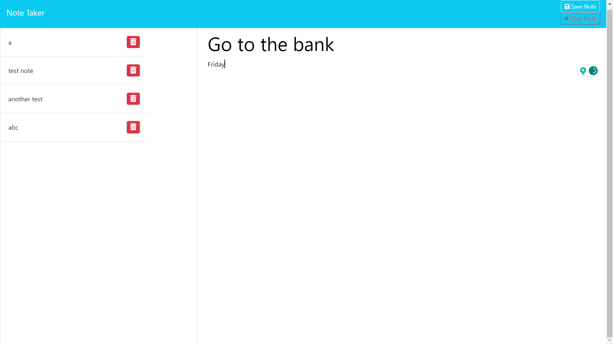

# Note Taker

## Description

Note Taker is an application that can be used to write, save, and retrieve notes. It uses an Express.js back end and saves/retrieves note data from a JSON file.

## Features

- Write new notes and save them
- View previously saved notes
- Delete previously saved notes

## Screenshots





## Link to Deployed Application

aa

## Running Locally

### Installation

To install the necessary dependencies locally, run the following command:

```bash
npm install
```

### Usage

To start the server locally, run the following command:

```bash
node server.js
```

Then, open your browser and go to `http://localhost:3000`.
